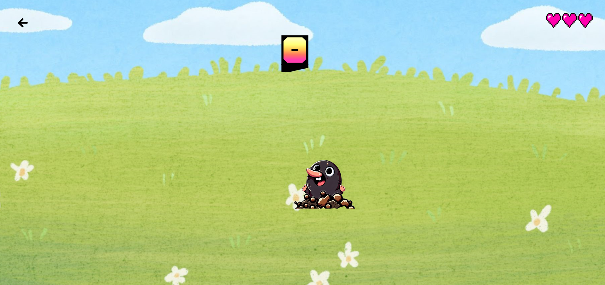

# KillEm: Whack-a-Mole Game

Welcome to **KillEm**, a modern, fun, and engaging Whack-a-Mole game built using React and Redux. Test your reflexes and see how many moles you can whack before you run out of lives!

## Table of Contents

- [Demo](#demo)
- [Features](#features)
- [Installation](#installation)
- [Snapshots](#snapshots)
- [Technologies Used](#technologies-used)
## Demo

Check out a live demo of the game [here](#).

## Features

- Interactive gameplay where moles randomly appear on the screen.
- Score tracking to keep a record of your performance.
- Lives indicator to show how many attempts you have left.
- Responsive design with Tailwind CSS for a smooth experience across devices.

## Installation

To run this project locally, follow these steps:

1. Clone the repository:

   ```bash
   git clone https://github.com/Rohan216437/killEm.git
   cd killem
   ```

2. Install the dependencies:

   ```bash
   npm install
   ```

3. Start the development server:

   ```bash
   npm start
   ```

The game should now be running on `http://localhost:3000`.

## Snapshots


*Main Page with Play button*


*Game Page with interactive mole, score, and lives*

## Technologies Used

- **React**: JavaScript library for building user interfaces.
- **Redux Toolkit**: For state management.
- **React Router**: For routing.
- **Tailwind CSS**: For styling.
- **React Icons**: For icons.

Enjoy the game and happy whacking! If you encounter any issues or have suggestions, feel free to open an issue or contact us.

